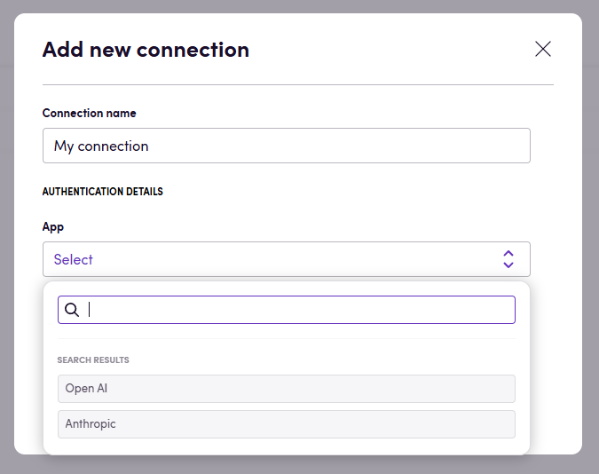

# Blackbird.io Blackbird Repurpose

Blackbird is the new automation backbone for the language technology industry. Blackbird provides enterprise-scale automation and orchestration with a simple no-code/low-code platform. Blackbird enables ambitious organizations to identify, vet and automate as many processes as possible. Not just localization workflows, but any business and IT process. This repository represents an application that is deployable on Blackbird and usable inside the workflow editor.

## Introduction

<!-- begin docs -->

The Blackbird Repurpose app lets you repurpose content with any of the supported LLM models. The models currently supported are Anthropic and OpenAI.

## Before setting up

If you are connecting with OpenAI, make sure that:

- You have an [OpenAI account](https://platform.openai.com/signup).
- You have generated a new API key in the [API keys](https://platform.openai.com/account/api-keys) section, granting programmatic access to OpenAI models on a 'pay-as-you-go' basis. With this, you only pay for your actual usage, which [starts at $0,002 per 1,000 tokens](https://openai.com/pricing) for the fastest chat model. Note that the ChatGPT Plus subscription plan is not applicable for this; it only provides access to the limited web interface at chat.openai.com and doesn't include OpenAI API access. Ensure you copy the entire API key, displayed once upon creation, rather than an abbreviated version. The API key has the shape `sk-xxxxxxxxxxxxxxxxxxxxxxxxxxxxxxxxxxxxxxxxxxxxxxxx`.
- Your API account has a payment method and a positive balance, with a minimum of $5. You can set this up in the [Billing settings](https://platform.openai.com/account/billing/overview) section.

**Note**: Blackbird by default uses the latest models in its actions. If your subscription does not support these models then you have to add the models you can use in every Blackbird action.

If you are connecting with Anthropic, make sure that:

- You have an [Anthropic account](https://console.anthropic.com) and have access to the API keys.

## Connecting

1. Navigate to apps and search for RePurpose.
2. Click _Add Connection_.
3. Choose the model you want to connect to.
4. Fill in your API key obtained earlier.
5. Click _Connect_.

## Actions

- **Repurpose text** repurposes content to a specific target audience.
- **Repurpose** repurposes file contents and returns a repurposed file. Compatible formats are: plaintext (txt, csv, etc.), HTML and XLIFF.

Repurpose takes the following parameters:
- **Instructions** how the content should be repurposed. E.g. target audience, tone of voice, vocabulary, length, etc.
- **Model** (optional) the LLM model to use. If no model is selected, Open AI will use gpt4-o and Anthropic will use Claude 3.5 Sonnet
- **Language** (optional) the target language the content should be created in. If an XLIFF with a target language was given as input then this will be used if not manually set.
- **Glossary** (optional) a glossary that will be used for the repurposing.

## Feedback

Do you want to use this app or do you have feedback on our implementation? Reach out to us using the [established channels](https://www.blackbird.io/) or create an issue.

<!-- end docs -->
